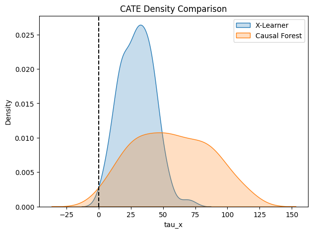

# CATE Estimation: X‑Learner vs. Causal Forest (BMI‑Based Subgroups)

This repository compares two causal machine learning approaches — **X‑Learner** and **Causal Forest** — for estimating **heterogeneous treatment effects** using an observational diabetes dataset.

The analysis focuses on whether the **treatment effect differs between individuals with low BMI and high BMI**.

---

## 1. Outcome Definition

- **Outcome variable**: Disease **progression score**
- **Unit**: *Progression units* (as provided by the dataset)
- The outcome is **continuous** and higher values indicate **worse disease progression**

No transformation or rescaling was applied; all reported treatment effects are expressed in **original outcome units**.

---

## 2. Treatment Assignment (Deterministic)

Treatment assignment is **not randomized**.

Instead, individuals are deterministically assigned based on a BMI threshold:

- **Covariate (X)**: Body Mass Index (BMI)
- **Median BMI value**:
\[
\text{Median} = 0.0017505
\]

### Group Definition
- **Treatment group (High BMI)**:  
  \[
  \text{BMI} > 0.0017505
  \]

- **Control group (Low BMI)**:  
  \[
  \text{BMI} \le 0.0017505
  \]

This rule-based split induces a **non-random, observational treatment assignment**, motivating the use of causal ML methods.

---

## 3. Subgroup-Specific Treatment Effects

Subgroup-specific Average Treatment Effects (ATEs) are computed by averaging individual CATE estimates within each BMI group.

### Summary Table

| BMI Group | X‑Learner ATE | Causal Forest ATE |
|----------|--------------|------------------|
| Low BMI (Control) | 23.64 | 55.50 |
| High BMI (Treatment) | 35.66 | 57.69 |

---

## 4. Interpretation of Results

### X‑Learner
- The **high‑BMI (treatment) group** shows a **larger treatment effect**
- Difference:
\[
\text{CATE}_{\text{High BMI}} - \text{CATE}_{\text{Low BMI}} \approx +1.8
\]
- This suggests a **modest but positive differential effect**
- Interpretation: **mild treatment effect heterogeneity**

### Causal Forest
- Treatment effects are **larger overall** and more variable
- The difference between BMI groups is smaller relative to variance
- This reflects Causal Forest’s higher sensitivity to heterogeneity

---

## 5. Density Plot of CATE Estimates

This figure compares the **distribution of individual CATE estimates** produced by each model:

- **X‑Learner**
  - Narrower, smoother distribution
  - More conservative effect estimates

- **Causal Forest**
  - Wider distribution with heavier tails
  - Indicates stronger detected heterogeneity

The dashed vertical line at zero highlights that **most estimated treatment effects are positive**, indicating overall treatment benefit.

---

## 6. Key Takeaway

> **Yes, the treatment effect differs between individuals with low BMI and high BMI.**

- The treatment is **effective in both groups**
- High‑BMI individuals experience a **slightly stronger effect**
- The difference (~1.8 progression units) indicates **quantitative (mild) heterogeneity**, not a qualitative subgroup reversal

---

## 7. Why This Matters

This analysis demonstrates how causal machine learning methods can move beyond a single global ATE to provide **interpretable, subgroup‑specific causal insights**, even under deterministic treatment assignment in observational data.

---

## 8. Files

- `cate_xlearner_vs_causal_forest.ipynb` — main analysis notebook
- `figures/cate_density.png` — CATE density comparison plot
